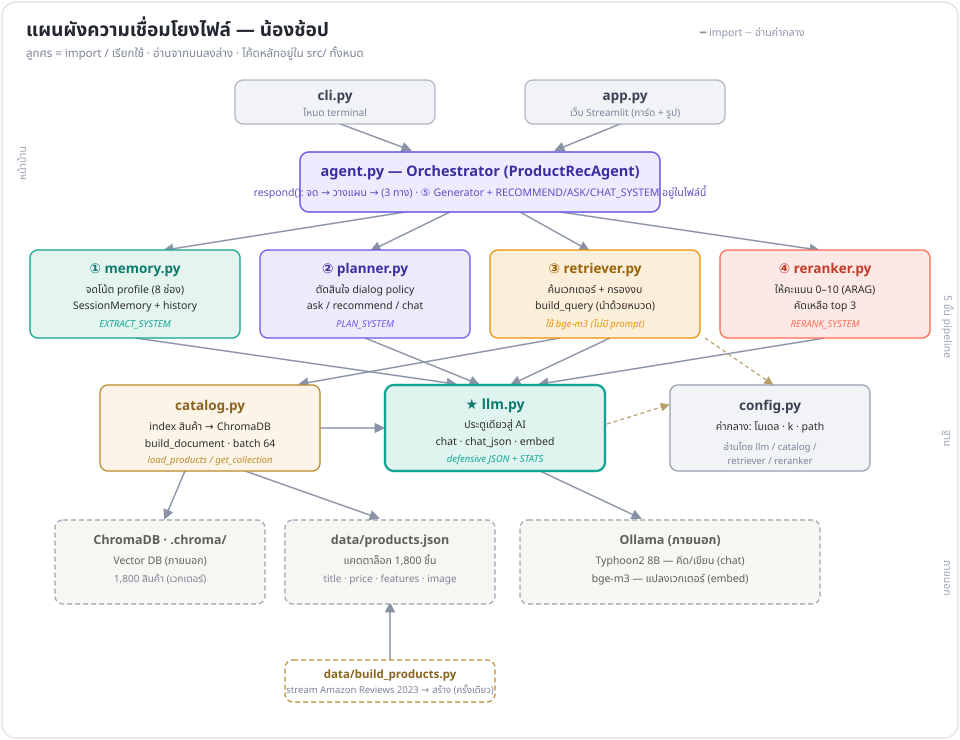
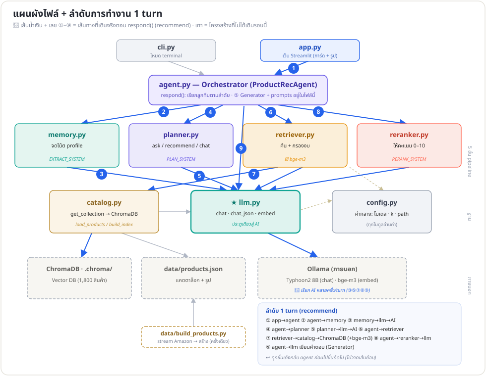
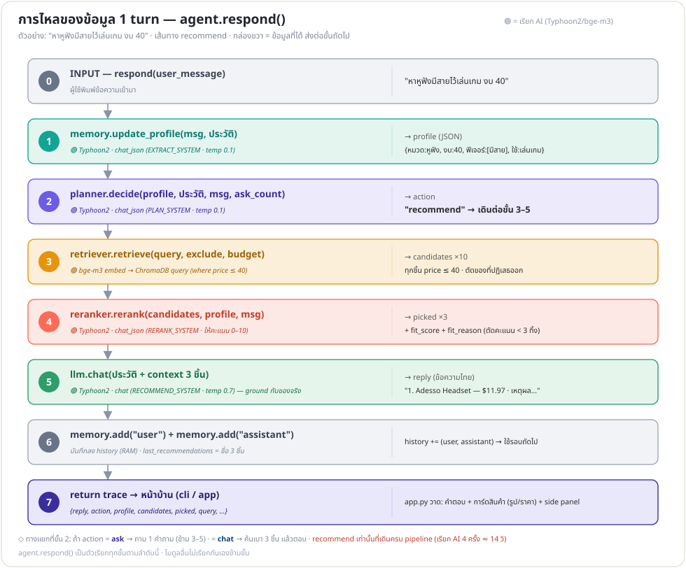

# 🗺️ คู่มืออ่านโค้ด — น้องช้อป

เอกสารนี้ช่วยให้เปิดโค้ดใน IDE แล้วเข้าใจว่า **ไฟล์เชื่อมกันยังไง** และ **ทำงานยังไงตอนรัน 1 turn** มี 3 แผนภาพเรียงจาก "โครงสร้าง" → "การทำงาน"

> เปิดดูรูป: VS Code กด `Ctrl+Shift+V` (Markdown Preview) · หรือดูบน GitHub จะ render ให้อัตโนมัติ
>
> 📖 อยากอ่านโค้ด**ทีละไฟล์อย่างละเอียด** (ตามลำดับการทำงาน) → [`code-walkthrough.md`](code-walkthrough.md)

---

## 1️⃣ โครงสร้างไฟล์ — ใครพึ่งใคร (import)



ไฟล์แบ่งเป็น **4 ชั้น** (บนลงล่าง) · ลูกศร = `import` / เรียกใช้

| ชั้น | ไฟล์ | import อะไร |
|---|---|---|
| **หน้าบ้าน** | `cli.py` · `app.py` | `agent`, catalog, llm |
| **Orchestrator** | `agent.py` | `llm, catalog, memory, planner, retriever, reranker` (ทุกตัว) |
| **5 ขั้น** | `memory.py` · `planner.py` | `llm` |
| | `retriever.py` | `config, llm, catalog` |
| | `reranker.py` | `config, llm` |
| **ฐาน** | `llm.py` | `config`, ollama |
| | `catalog.py` | `config, llm`, chromadb |
| | `config.py` | *(ไม่ import ใคร)* |

**2 จุดที่ต้องจำ:**
- **`llm.py` = คอขวดเดียวสู่ AI** — ทุกขั้น + catalog พุ่งเข้าหมด → เปลี่ยนโมเดล/เพิ่ม log แก้ไฟล์เดียว
- **`config.py` = ไม่พึ่งใคร แต่ทุกคนพึ่งมัน** → เปลี่ยนค่าโมเดล/k/path ที่นี่ที่เดียว

> ⚠️ สังเกต: `memory / planner / retriever / reranker` **ไม่ import กันเอง** — ต่างเป็นโมดูลอิสระ รู้จักแค่ `llm` · การเชื่อม 5 ขั้นเข้าด้วยกันเกิดที่ `agent.py` ตอน**รัน** ไม่ใช่ตอน import (ดูรูปที่ 2–3)

**ลำดับอ่านโค้ดที่แนะนำ (จากฐานขึ้นไป):**
```
config.py → llm.py → catalog.py        (เครื่องมือ)
  → memory / planner / retriever / reranker   (5 ขั้น ทีละตัว)
  → agent.py (respond ร้อยทุกอย่าง)    ← เห็นภาพรวม
  → cli.py / app.py                     (หน้าบ้าน)
```

---

## 2️⃣ ลำดับการทำงาน 1 turn — บนแผนผังไฟล์



ตัวอย่าง: ผู้ใช้พิมพ์ **"หาหูฟังมีสายไว้เล่นเกม งบ 40"** (เส้นทาง `recommend`) · 🔵 เส้นน้ำเงิน = เดินจริง · เทา = โครงสร้างที่ไม่ได้เดินรอบนี้

| # | hop | เกิดอะไร |
|---|---|---|
| ① | `app.py → agent.py` | เรียก `respond(msg)` |
| ② | `agent → memory` | `update_profile()` |
| ③ | `memory → llm → Ollama` | Typhoon2 สกัด → **profile JSON** |
| ④ | `agent → planner` | `decide()` |
| ⑤ | `planner → llm → Ollama` | Typhoon2 → **action = recommend** |
| ⑥ | `agent → retriever` | `retrieve()` |
| ⑦ | `retriever → catalog → ChromaDB` (+ bge-m3 embed) | **candidates ×10** (กรอง price ≤ 40) |
| ⑧ | `agent → reranker → llm → Ollama` | Typhoon2 ให้คะแนน → **picked ×3** |
| ⑨ | `agent → llm → Ollama` | Typhoon2 เขียน (Generator) → **reply** |

**รูปแบบ = ดาว (star) รอบ `agent.py`:** เลขคู่ (②④⑥⑧) ออกจาก agent สั่งลูกทีม · เลขคี่ (③⑤⑦⑨) พุ่งลง `llm.py` เรียก AI · **ทุกขั้นเด้งกลับ agent ก่อนไปขั้นถัดไป** (ไม่มี hop ตรงระหว่าง 5 ขั้น)

---

## 3️⃣ การไหลของข้อมูล 1 turn — ข้อมูลเปลี่ยนรูป



มองอีกมุม: โฟกัสที่ **ข้อมูล** ที่ส่งต่อกันแต่ละขั้น (คอลัมน์ขวาของรูป)

```
text → profile(JSON) → action → candidates×10 → picked×3 → reply → trace→UI
```

- **🟢 = จุดเรียก AI** → recommend เรียก **AI 4 ครั้ง** (Typhoon2 ×3 + bge-m3 ×1) = เหตุผลที่ ~14 วิ/turn
- **ทางแยกที่ขั้น 2 (planner):** `recommend` เดินครบ · `ask` ถาม 1 คำถาม (ข้าม 3–5) · `chat` ค้นเบา + ตอบ

---

## 📁 ตารางไฟล์ (อ้างอิงเร็ว)

| ไฟล์ | หน้าที่ | system prompt |
|---|---|---|
| `src/config.py` | ค่ากลาง — โมเดล, k, path | — |
| `src/llm.py` | คุย Ollama: `chat` / `chat_json` / `embed` + defensive JSON | — |
| `src/catalog.py` | โหลดสินค้า → embed → ChromaDB (index) | — |
| `src/memory.py` | จด profile (8 ช่อง) + history | `EXTRACT_SYSTEM` |
| `src/planner.py` | ตัดสิน `ask` / `recommend` / `chat` | `PLAN_SYSTEM` |
| `src/retriever.py` | ค้นเวกเตอร์ + budget hard filter | *(ใช้ bge-m3)* |
| `src/reranker.py` | ให้คะแนน 0–10 คัดเหลือ 3 (ARAG) | `RERANK_SYSTEM` |
| `src/agent.py` | **Orchestrator** + Generator (⑤) | `RECOMMEND` / `ASK` / `CHAT_SYSTEM` |
| `cli.py` / `app.py` | หน้าบ้าน (terminal / เว็บ) | — |

> โมเดลตัวเดียว (Typhoon2) เล่น 4 บทบาท ต่างกันแค่ system prompt: นักสกัด → นักวางแผน → กรรมการให้คะแนน → นักเขียน
